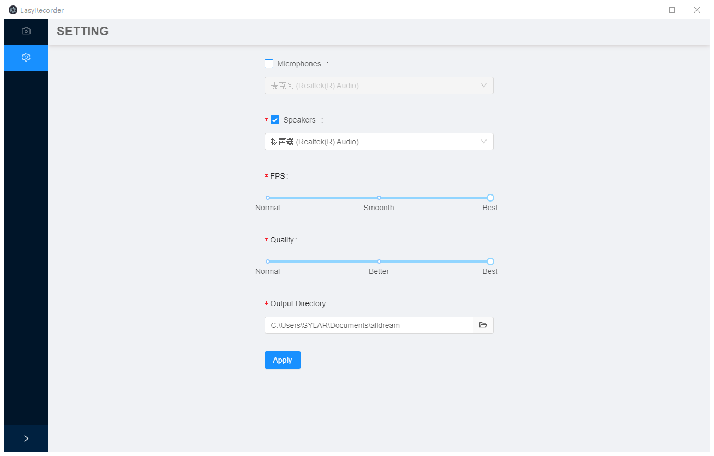

# ffmpeg-recorder

This is a node-js addon by screen-recorder which is written by c++ based on ffmpeg.

Only support windows(at least windows7 sp1) for now.


## Features

- Save screen、speaker、miccrophone to a signle file as mp4 or mkv
- yuv data callback
- Remux file to another file format
- Support hardware encode with NVIDIA cards

## Usage


### 1.Add ffmpeg-recorder addon to your package.json

```sh
$ npm install ffmpeg-recorder

# or

$ yarn add ffmpeg-recorder
```

### 2.Add parameters to your package.json file

build electron version:

```json
"ffmpeg_recorder": {
    "electron_version": "7.1.4",
    "platform": "win32",
    "runtime":"electron",
    "msvs_version": "2015",
    "debug": false,
    "silent": false
  }
```

or build node version:

```json
"ffmpeg_recorder": {
    "platform": "win32",
    "runtime":"node",
    "msvs_version": "2015",
    "debug": false,
    "silent": false
  }
```


## Test code

##### Record  
```js

"use strict";
const EasyRecorder = require('./lib/index')


const recorder = new EasyRecorder();

const speakers = recorder.GetSpeakers();
const mics = recorder.GetMics();
const vencoders = recorder.GetVideoEncoders();

console.log(speakers);
console.log(mics);
console.log(vencoders);

let ret = recorder.Init(
  60,
  20,
  ".\\save.mkv",
  //".\\save.mp4",
  speakers[0].name,
  speakers[0].id,
  mics[0].name,
  mics[0].id,
  vencoders[0].id
  );


console.info('recorder init ret:',ret,recorder.GetErrorStr(ret));


if(ret == 0){

  ret = recorder.Start();

  console.info('start',ret);

  setTimeout(()=>{

    recorder.Stop();
    recorder.Release();
  },10000);
}


```

##### Remux

```js

"use strict";
const EasyRecorder = require('./lib/index')


const recorder = new EasyRecorder();

const onProgress = (src,progress,total)=>{
    console.info('on remux progress:',src,progress,total);
};

const onState = (src,state,error) =>{
    console.info('on remux state:',src,state,recorder.GetErrorStr(error));
};

let ret = recorder.RemuxFile(
    ".\\save.mkv",
    ".\\save.mp4",
    onProgress,
    onState
);

console.info('remux file ret:',ret,recorder.GetErrorStr(ret));


```

## Enable preview

``` js

recorder.EnablePreview(true);
recorder.SetPreviewElement(document.getElementById("dom-id"));

```

## Disable preview

``` js

recorder.EnablePreview(false);

```

## EasyRecorder UI Project

https://github.com/peilinok/EasyRecorder


